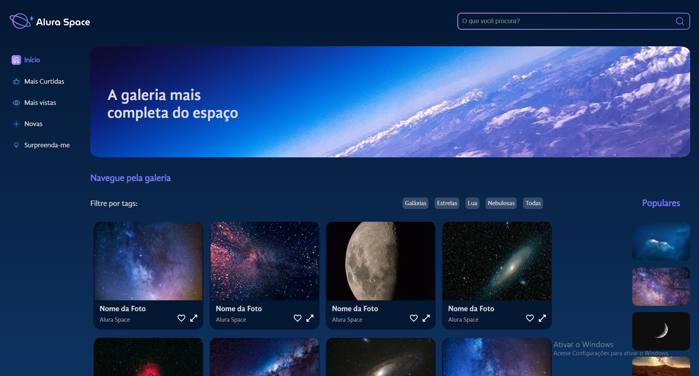

# Projeto Alura Space


O projeto alura space é uma landing page que exibe uma galeria de fotos relacionadas ao espaço sideral.

## 📌Índice 
- <a href="#tecnologias-utilizadas">Tecnologias utilizadas</a>
- <a href="#proposito">Propósito</a>
- <a href="#funcionalidades-do-projeto">Funcionalidades do Projeto</a>
- <a href="#layout">Layout</a>
- <a href="#projeto">Projeto</a>
- <a href="#como-rodar-o-projeto">Como rodar o projeto</a>
- <a href="#autores">Autores</a>

## 📱Tecnologias utilizadas
1. [React](https://legacy.reactjs.org)
## 🎯Propósito
O propósito deste projeto em React é aprimorar os conhecimentos na biblioteca React. Foi um projeto acadêmico criado em colaboração com a Alura, com o objetivo de explorar e dominar os conceitos da criação de uma landing page em React.

Durante o projeto, adquiri conhecimentos essenciais sobre React, como hooks, JSX e virtual DOM.

## 🖥Funcionalidades do Projeto

✔ Galeria de fotos.<br>
✔ Filtro das fotos exibidas na galeria.

## 🧩Layout



## 🎮Projeto
➡  [link do projeto](https://space-gallery-pi.vercel.app) ⬅

## ⚠Como Rodar o Projeto
```bash
# Clone este repositório
$ git clone https://github.com/Jonas-Sousa/alura-space.git

# Acesse a pasta do projeto no seu terminal
$ cd alura-space

# Instale as dependências
$ npm install

# Execute a aplicação
$ npm start
```
## 😎Autores 

  <br>
  <p>Jonas Sousa</p>
  
  
  [Linkedin](https://www.linkedin.com/in/jonas-sousa-dev/)
